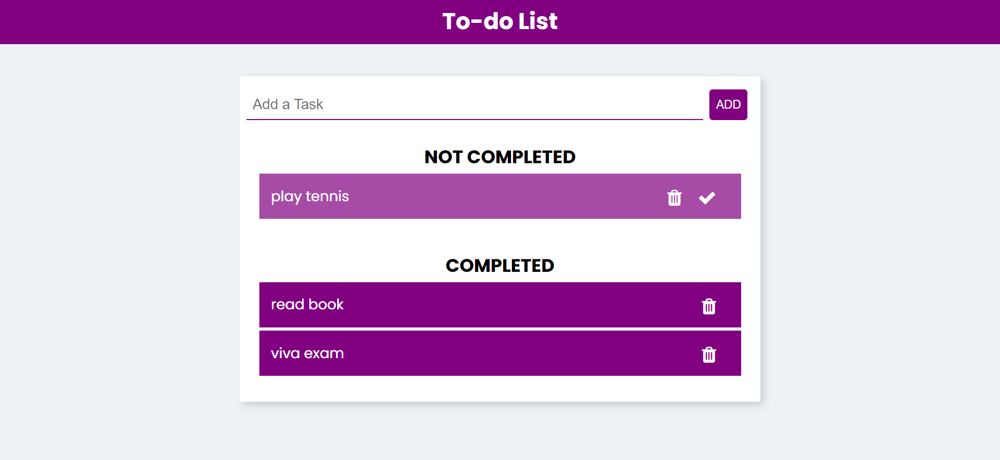

# Todo App

> This is Todo app created using pure HTML,CSS and JavaScript, where you can add and remove the Todos. You can also mark todo as done and you can differentiate completed and not completed Todos.
>   
> [Visit site](https://hiralvala.github.io/todo-list-using-javascript/)  
>   

- Let's add some todo using Add button
   
    

- Mark some todos done using right tick mark inside todo
   
    

- Delete completed todos
   
    
